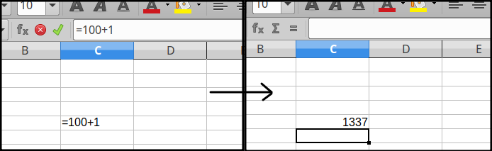

# PINcher
This is basically a (partial) reimplementation of [tracer](https://yurichev.com/tracer-en.html) by Dennis Yurichev for linux OS, implemented using Intel PIN.

The tool can perform simple debugging tasks, such as log/modify register/memory values at runtime.

Currently, it only supports x86-64 ELF binaries.

## Build
Run `build.sh`, it will download PIN 3.19 and compile the pintool.

## Options
#### Dump Callgraph
`--callgraph <outfile.dot>`: dump the (partial) callgraph in _outfile.dot_.

#### Print Loaded Symbols (symbs)
`--symbs <regex>`: print all symbols loaded by the traced program that matches the regex. The regex has this shape: `<module_name>#<symbol_name>`. 

Ex: print all symbols defined in the traced program:
```
$ pincher --symbs "dummy#.*" -- /path/to/dummy
...
<symbol>  [Address] 0x55aef06cd67c ( dummy+0x67c )	[SymbolName] bar
...
```
Ex: print all symbols in libc (loaded by dummy):
```
$ pincher --symbs "libc.*#.*" -- /path/to/dummy
...
<symbol>  [Address] 0x7fb5ec041bb0 ( libc.so.6+0x43bb0 )	[SymbolName] srand
...
```
#### Function Breakpoint (bpf)
`--bpf <address/regex>,<opt>,<key>:<value>,...`: log that the function at address (or the function that matches the regex) is called. Other optional arguments are passed in the form of `<opt>` or `<key>:<value>`. Notice that the regex has the shape `<module_name>#<symbol_name>`.

The optional arguments are:
- `module:<module_name>`: if you specify the address (and not the regex), `<module_name>` is the name of the module that will be used as a base for the address (e.g., `--bpf "0xaa,libc.so.8"` triggers the breakpoint at `LIBC_BASE+0xaa`). If omitted, the base of the main module will be used.
- `args:<nargs>`: tell the tool how many arguments the function has. If set, the tool will log also the arguments.
- `dump_args:<size>`: if the arguments are pointers, dump `<size>` bytes of memory starting from the address pointed by the argument. 
- `skip`: skip the execution of the function (jump to return address).
- `rt:<value>`: force the function to return `<value>`.
- `bt`: dump callstack (up to 30 elements).

Ex: log all calls to `strcmp`:
```
$ pincher --bpf "strcmp,args:2" -- /path/to/dummy bla
<bpf beg>  strcmp@plt @ dummy+0x5b0 ( 0x7fffeb6c6e40 "bla", 0x55d823cd77fc "ciao" )  [ called from dummy!main+0x4b @ dummy+0x72e ]
<bpf end>  strcmp@plt -> 0xffffffff
```

Ex: dump `write` arguments:
```
$ pincher --bpf "write,args:3,dump_args:32" -- /path/to/dummy bla
...
<bpf beg>  write @ libc.so.6+0x110140 ( 0x1, 0x5650223d8260 "I'm in foo!", 0x1d )  [ called from libc.so.6!_IO_file_write+0x28 @ libc.so.6+0x8b1b8 ]
  dumping arg 1
  0x00005650223d8260: 49 27 6d 20 69 6e 20 66 6f 6f 21 0a 49 27 6d 20   "I'm in foo!.I'm "
  0x00005650223d8270: 69 6e 20 62 61 72 21 0a 61 3a 20 33 0a 00 00 00   "in bar!.a: 3...."
...
<bpf end>  write -> 0x1d
```

Ex: dump `write` backtrace:
```
$ pincher --bpf "write,args:3,bt" -- /home/luca/Documents/code/c/dummy/dummy bla
...
<bpf beg>  write @ libc.so.6+0x110140 ( 0x1, 0x55b978779260 "I'm in foo!", 0xc )  [ called from libc.so.6!_IO_file_write+0x28 @ libc.so.6+0x8b1b8 ]
  CALLSTACK
  >>> libc.so.6+0x8b1b8 ( _IO_file_write+0x28 )
  >>> libc.so.6+0x8cf4d ( _IO_do_write+0xad )
  >>> libc.so.6+0x8d3fe ( __overflow+0xfffffffffffff56e [ tailjmp? ] )
  >>> libc.so.6+0x80b5d ( puts@plt+0x296ddd45960d [ tailjmp? ] )
  >>> dummy+0x687 ( bar+0xb )
  >>> dummy+0x6bb ( main+0x28 )
  >>> libc.so.6+0x21b95 ( __libc_start_main+0xe5 )
<bpf end>  write -> 0xc
...
```

#### Generic Breakpoint (bpx)
`--bpx <address>,<opt>,...`: log the state of the machine just before the execution of the the instruction at address. 

As for `bpf`, it is possible to specify other optional arguments:
- `module:<module_name>`: as before, this is the name of the module whose base is used to calculate the virtual address. If omitted, the base of the main module is used.
- `set(<reg_name>, <reg_value>)`: set `<reg_name>` to `<reg_value>` just before the execution of the instruction. `<reg_value>` can be expressed in decimal, hexadecimal and floating point.
- `dump(<reg_name>, <size>)`: dump the value of `<reg_name>` and, if it points some mapped memory, dump also `<size>` bytes starting from the first address pointed by the register.

Ex: 
```
$ pincher --bpx "0x710" -- /path/to/dummy
...
<bpx beg> dummy+0x710 ( dummy!main+0x2d )
  rax: 0x0000000000000002  rbx: 0x0000000000000000  rcx: 0x00000000fbad2a84  
  rdx: 0x00007f98e531a8c0  rsi: 0x000055e39d097260  rdi: 0x0000000000000001  
  rsp: 0x00007ffc7a54b220  rbp: 0x00007ffc7a54b240  rip: 0x000055e39c025710  
<bpx end>
...
```

Ex:
```
$ pincher --bpx "0x710,set(rdx,0xabadcafe),set(xmm0,16.1)" "0x713,dump(xmm0,1)" -- /path/to/dummy
...
<bpx beg> dummy+0x710 ( dummy!main+0x2d )
  rax: 0x0000000000000002  rbx: 0x0000000000000000  rcx: 0x00000000fbad2a84  
  rdx: 0x00007f44e2ca88c0  rsi: 0x000055cd3ac8d260  rdi: 0x0000000000000001  
  rsp: 0x00007ffeafe20780  rbp: 0x00007ffeafe207a0  rip: 0x000055cd3a0c0710  

  SET rdx <- 0xabadcafe

  SET xmm0 <- 16.1
<bpx end>
<bpx beg> dummy+0x713 ( dummy!main+0x30 )
  rax: 0x0000000000000002  rbx: 0x0000000000000000  rcx: 0x00000000fbad2a84  
  rdx: 0x00000000abadcafe  rsi: 0x000055cd3ac8d260  rdi: 0x0000000000000001  
  rsp: 0x00007ffeafe20780  rbp: 0x00007ffeafe207a0  rip: 0x000055cd3a0c0713  

  xmm0: 0x403019999999999a
<bpx end>
...
```

## Example of Use
#### Change the result of every arithmetic operations in libreoffice calc

We can use `pincher` to change the result of every arithmetic operation performed by libreoffice calc in a cell.

For example, using `LibreOffice 6.0.7.3 00m0(Build:3)` on `ubuntu 18.04`, we can execute:

```
$ pincher --bpx "0x6ed92e,module:libsclo.so,dump(xmm2,1),set(xmm2,1337.0)" -- /usr/lib/libreoffice/program/soffice.bin --calc
```

after some time, libreoffice calc will start. If we try to perform an arithmetic operation in a cell, we will obtain always `1337` as result.


